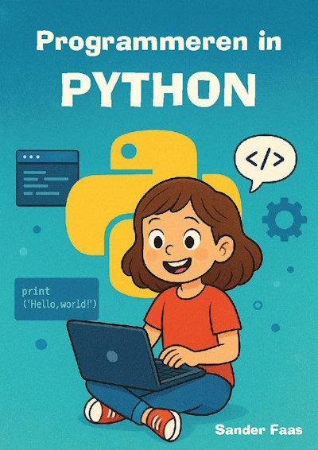

Programmeren in Python
===================================

Op deze pagina vind je de *assets* die nodig zijn voor de Pygame Zero projecten in het boek Programmeren in Python.

.. toctree::
   :maxdepth: 1
   :caption: Assets voor de projecten

   01_pygame_zero_intro/pygame_zero_intro
   02_fruit_catcher/fruitcatcher
   03_actor_positioning/actor_positioning

.. toctree::
   :maxdepth: 1
   :caption: Datastructuren

   datastructures/lists

.. toctree::
   :maxdepth: 1
   :caption: Level Devil

   leveldevil/01 intro
   leveldevil/02 rectangles
   leveldevil/03 player