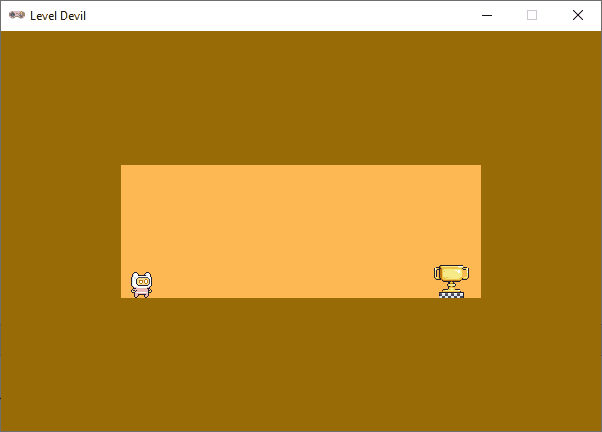

.. role:: python(code)
   :language: python

.. |br| raw:: html

    

Level devil
===================

`Level Devil <https://poki.com/en/g/level-devil>`_ is een platformer game waarin de speler telkens wordt verrast met onverwachte valkuilen. Een platformer game programmeren is geen sinecure, maar ook voor beginnende programmeurs is het zeer wel mogelijk om met Pygame Zero enkele eenvoudige Level Devil levels te maken.

Starter code
-----------------

Maak voor deze game een nieuwe map aan met de naam :file:`level devil`. Start in Mu editor een nieuw codebestand en sla het op in de nieuwe map onder de naam :file:`level_devil.py`. Plaats de onderstaande code in het bestand.

.. code-block:: python
    :linenos:
    :caption: level_devil.py

    # Vensterinstellingen
    WIDTH = 600
    HEIGHT = 400
    TITLE = 'Level Devil'

    COLOR_BACKGROUND = (153, 107, 7)
    COLOR_ROOM = (254, 184, 84)

    def draw():
        screen.fill(COLOR_BACKGROUND)

    def update():
        pass

In regels 6 en 7 worden de kleuren voor de achtergrond en de kamer gedefinieerd met RGB-waarden. De functies ``draw()`` en ``update()`` bevatten beide slechts één regel code. Regel 10 vult het venster met de achtergrondkleur en regel 13 is opvulling omdat je in Python geen lege functies mag hebben.