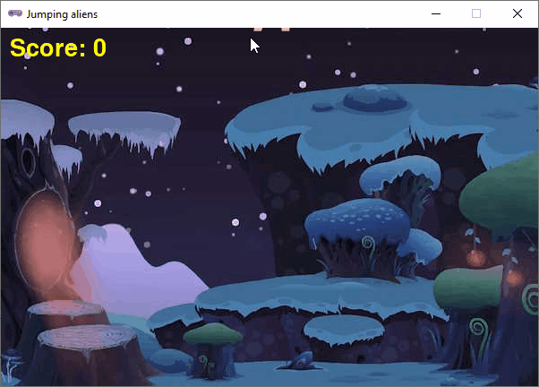

Jumping aliens
===============

Met `Pygame Zero <https://pygame-zero.readthedocs.io/>`_ kun je grafische games programmeren, waarin je afbeeldingen, animaties en geluiden gebruikt. Pygame Zero is een vereenvoudigde versie van de populaire `Pygame <https://www.pygame.org/>`_ module (zonder de toevoeging Zero), die speciaal is ontworpen voor beginnende Python programmeurs.

In dit deel maak je kennis met Pygame Zero door het programmeren van een eenvoudige game waarin je aliens in de lucht moet houden door erop te klikken.

.. toctree::
    :maxdepth: 1
    :numbered:
    :caption: Inhoudsopgave

    01_pygame
    02_sprites
    03_movement
    04_events
    05_score
    06_improvements